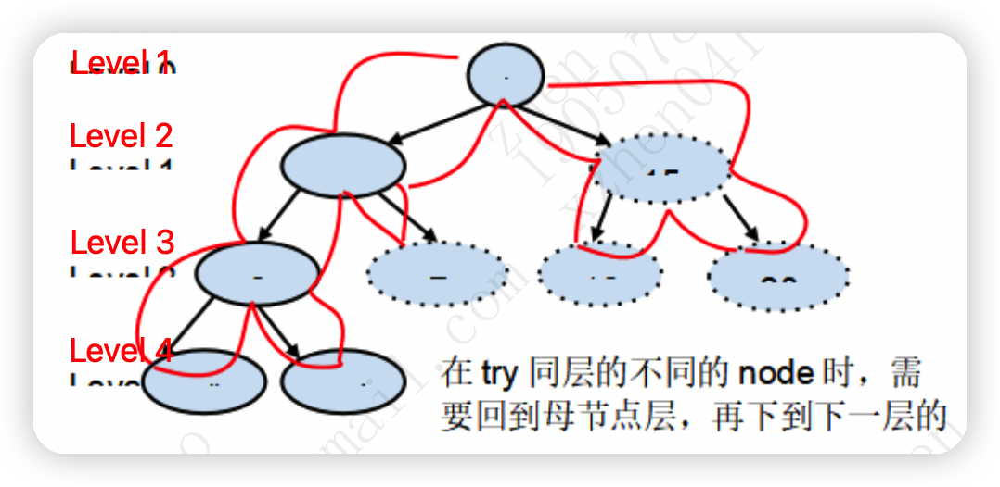
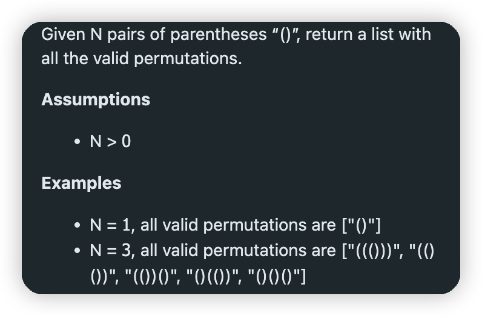
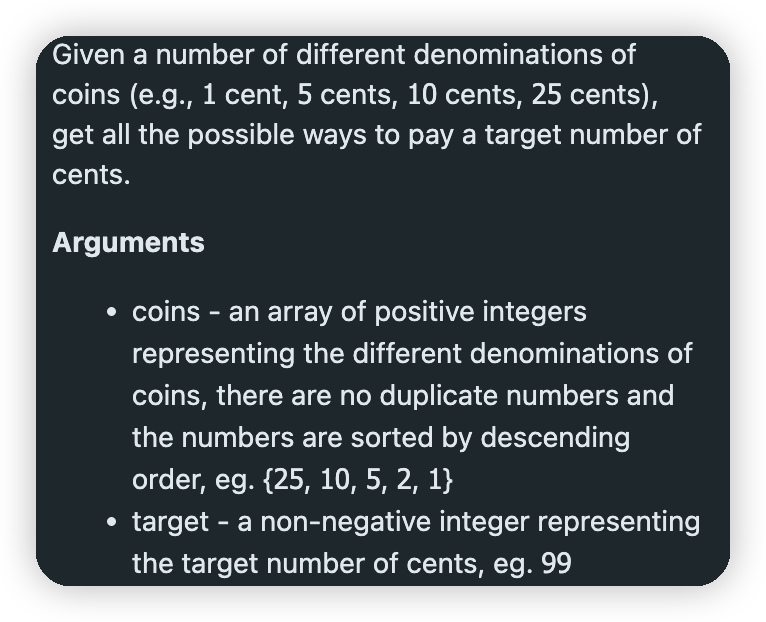
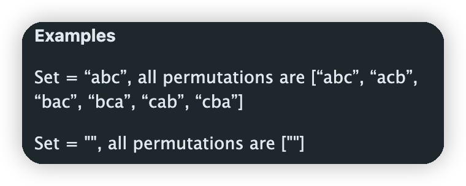
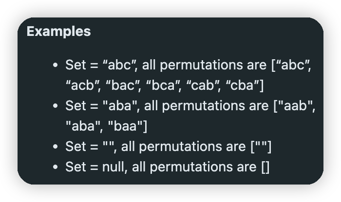

# DFS

Pre-order traversal binary tree



Pre-order traverse a binary tree is a DFS in fact. DFS is one kind of search algorithm. DFS can be implemented in an either recursive way(in most situation) or in iterative way. Back-tracking describes the behavior of DFS.

## DFS的四大类母题

### 解决DFS类问题的基本方法：

1. 一般来讲，解题之前就知道DFS要递归多少层，每层代表什么含义。
2. 每层有多少个状态/case需要try。

### Print all subsets of a set.

Print all subsets of a set S = {‘a’, ’b’, ‘c’}. No duplicate letters in S.

```java
public List<String> subSet(String set) {
  List<String> list = new ArrayList<>();
  if (set == null) return list;
  StringBuilder sb = new StringBuilder();
  DFS(set, list, 0, sb);
  return list;
}

private void DFS(String set, List<String> list, int index, StringBuilder sb) {
  if (index == set.length()) { //因为index从0开始，所以最后一层应该是set.length() - 1
    list.add(sb.toString()); //当index == set.length()时，表明已经把最后一层的某个状态节点处理完
    return;
  }
  sb.append(set.charAt(index));
  DFS(set, list, index + 1, sb);
  // 14.15行表示在每一层添加一个字符，添加完后继续下一层，直到第10行的条件触发。
  sb.deleteCharAt(sb.length() - 1);
  DFS(set, list, index + 1, sb);
  // 17.18行表示在每一层不添加字符，即不做任何处理，继续下一层，直到触发第10行。
}
```

Print all subsets of size K of a set S = {‘a’, ‘b’}. No duplicate letters.

```java
public List<String> subSetsOfSizeK(String set, int k) {
  List<String> list = new ArrayList<>();
  if (set == null) return list;
  StringBuilder sb = new StringBuilder();
  DFS(set, k, list, 0, sb);
  return list;
}

private void DFS(String set, int k, List<String> list, int index, StringBuilder sb) {
  if (index == set.length()) {
    if (sb.length() == k) {
      list.add(sb.toString());
    }
    return;
  }
  sb.append(set.charAt(index));
  DFS(set, k, list, index + 1, sb);
  sb.deleteCharAt(sb.length() - 1);
  DFS(set, k, list, index + 1, sb);
}
```

### Print all valid permutations of a string.

Find all valid permutations using the parenthesis provided.



[^分析]:以 ((()))来举例子。因为有3对括号，所以有6个位置。所以有6层，每一层代表一个位置。在每一层只有两个case可以选择，要么左括号，要么有括号。

```java
public List<String> validParentheses(int n) {
  List<String> list = new ArrayList<>();
  if (n == 0) return list;
  StringBuilder sb = new StringBuilder();
  DFS(list, 0, 0, sb);
  return list;
}

private void DFS(List<String> list, int left, int right, StringBuilder sb) {
  if (left == n && right == n) {
    list.add(sb.toString());
    return;
  }
  if (left < n) {
    sb.append('(');
    DFS(list, left + 1, right, sb);
    sb.deleteCharAt(sb.length() - 1);
  }
  if (right < left) {
    sb.append(')');
    DFS(list, left, right + 1, sb);
    sb.deleteCharAt(sb.length() - 1);
  }
}

```

### Print permutation of factors of a number.

Print all combinations of coins that can sum up to a total value n.



[^分析]:有多少层：k层。k代表硬币的种类。每层有多少个case：动态变化，从 0 ~ 可能的最大值(需要计算)。

```java
public List<List<Integer>> combinations(int target, int[] coins) {
  List<List<Integer>> list = new ArrayList<>();
  if (coins == null) return list;
  List<Integer> tmp = new ArrayList<>();
  DFS(target, coins, 0, list, tmp);
  return list;
}

private void DFS(int target, int[] coins, int index, List<List<Integer>> list, List<Integer> tmp) {
  if (index == coins.length) {
    if (target == 0) {
      list.add(new ArrayList<>(tmp));
    }
    return;
  }
  int value = coins[index];
  int number = target / number;
  //下面的for循环就是在遍历每一层的case
  for (int i = 0; i <= number; i++) {
    tmp.add(i);
    DFS(target - i * value, coins, index + 1, list, tmp);
    tmp.remove(tmp.length() - 1);
  }
}
```

### Given a string with no duplicate letters, print out all permutations of the string.



[^ 分析]:有多少层：n层。n是string中字母的个数，每层的意义是代表一个permutation中的一个位置。每层有多少个状态：剩余的未使用的字母的个数。

```java
public List<String> permutations(String input) {
  List<String> list = new ArrayList<>();
  if (input == null) return list;
  StringBuilder sb = new StringBuilder();
  boolean[] used = new boolean[input.length()];
  DFS(input, 0, list, sb, used);
  return list;
}

private void DFS(String input, int index, List<String> list, StringBuilder sb, boolean[] used) {
  if (input.length() == index) {
    list.add(sb.toString());
    return;
  }
  //下面的for循环，表示该位置上，依次使用剩余的未使用过的字母。
  for (int i = 0; i < input.length(); i++) {
    if (!used[i]) {
      used[i] = true;
      sb.append(input.charAt(i));
      DFS(input, index + 1, list, sb, used);
      used[i] = false;
      sb.deleteCharAt(sb.length() - 1);
    }
  }
}
```

## 进阶

### All Permutations with duplicate elements

Given a string with possible duplicate letters, return a list with all permutations of the letters.



```java
public List<String> permutations(String input) {
  List<String> list = new ArrayList<>();
  if (input == null)  return list;
  StringBuilder sb = new StringBuilder();
  boolean[] used = new boolean[input.length()];
  char[] arr = input.toCharArray();
  Arrays.sort(arr); // 排序是必不可少的，因为是无序数组，所以要把相同的字母放到一起
  DFS(list, new String(arr), 0, sb, used);
  return list;
}

private void DFS(List<String> list, String input, int index, StringBuilder sb, boolean[] used) {
  if (index == input.length()) {
    list.add(sb.toString());
    return;
  }
  for (int i =0; i < input.length(); i++) {
		if (!used[i]) {
			if (i - 1 >= 0 && !used[i - 1] && input.charAt(i - 1) == input.charAt(i)) {
        continue;
      }
      used[i] = true;
      sb.append(input.charAt(index));
      DFS(list, input, index + 1, sb, used);
      sb.deleteCharAt(sb.length() - 1);
      used[i] = false;
    }
  }
}
```

### 


