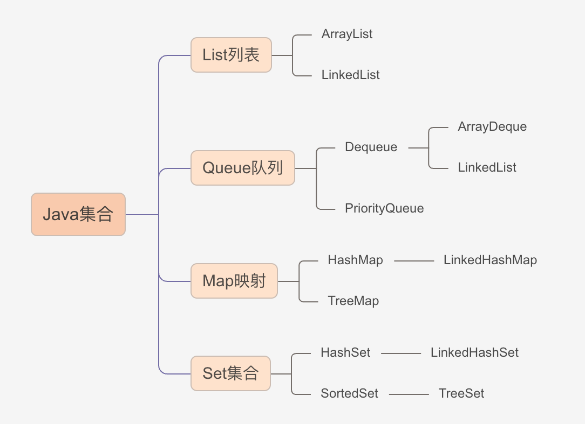

# 集合种类

Java中的集合主要有四类：

1. List列表：有序的，可重复的。
2. Queue队列：有序的，可重复的。
3. Set集合：不可重复，无序。
4. Map映射：无序，key唯一，value不唯一。

# 集合类的实现

# 集合的特点

## List

### ArrayList

是数组列表，有序，可重复。内部是通过array实现的，对数据列表进行插入、删除操作时都需要对数组进行拷贝并重新排序。因此在知道存储数据量时，尽量初始化初始容量，提升性能。

**常用API:**

List<String> list = new ArrayList<>();

1. list.add()
2. list.toString()
3. list.get(index)
4. list.remove(index)
5. list.remove(Object o)
6. list.set(index, value)
7. list.size()

### LinkedList

双向链表，每个元素都有向前和向后的指针。

## Queue

### ArrayDeque

是数组实现的双端队列，可以在队列的两端插入和删除元素。

### LinkedList

也是双向链表。

### PriorityQueue

堆。大顶堆和小顶堆，也称作是优先队列，数组实现的二叉树。

## 栈

实现栈用deque： Deque<Integer> stack = new LinkedList<>();

## Map

无序，key唯一，value不唯一。

### HashMap

最典型的实现方法，基于“拉链法”实现的散列表，一般用于单线程。key和value都可以是null。

### TreeMap

底层采用“红黑树”实现，一般用于单线程。可排序，红黑树是一种自平衡二叉查找树。

## Set

### HashSet

基于HashMap实现的集合，对HashMap做了一些封装。对元素的保存为链表形式，插入数据时遍历链表查看是否有相同数据。有则返回false，没有则返回true。

### TreeSet

红黑树集合，与TreeMap相似，是对TreeMap的封装。

