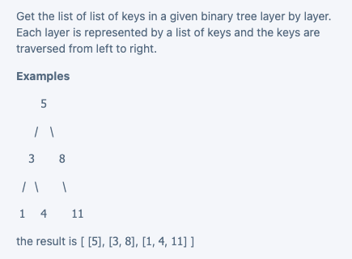
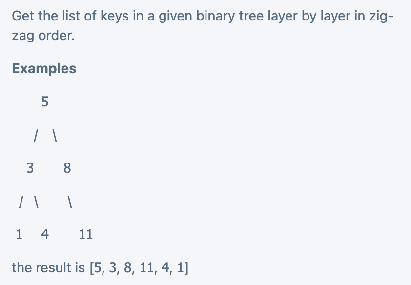
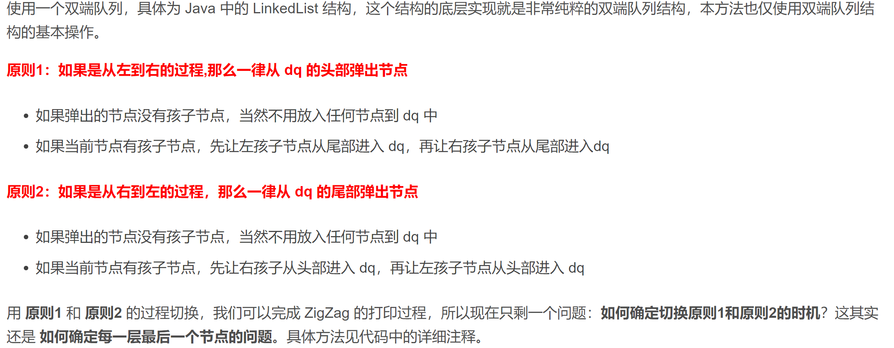

# 二叉树和二叉搜索树

## 数据结构

```java
class TreeNode {
  int value;
  TreeNode left;
  TreeNode right;
}
```

[^null问题]:只有当root == null的时候，root.left / root.right才会报NPE，如果root != null，那么root.left / root.right都不会报NPE，只不过是null而已。

## 遍历

### 前序遍历

pre-order: 我把我自己放在最前面打印/更改value，然后再左，右，即根左右。

### 中序遍历

in-order: 我把我自己放在中间打印/更改value，即左根右。

### 后序遍历

post-order: 我把自己放在最后，即左右根。

## 一些概念

### 平衡二叉树

balanced binary tree. 平衡二叉树的所有节点的左右高度之差不超过1。

如果一棵二叉树有n个节点，并且它是平衡的，那么它的高度就是logn。

如果一棵二叉树有n个节点，但是不知道它是否是平衡的，那么它的高度就是n。

### 完全二叉树

completed binary tree. 就是除最后一层，其他层都是饱满的，即每个节点都有两个子节点。在最后一层，所有的节点都是从左往右填充。

如果一棵树是完全二叉树，那么它一定是平衡二叉树。

### 二叉搜索树

binary search tree. 它的所有的节点，都满足以下条件：左子节点的值小于根节点，右子节点的值大于根节点。

如果用中序遍历打印二叉搜索树，会得到一个升序的数组。

## 跟递归的关系

只需要考虑在当前层做什么，进行什么处理，然后返回给上一层或者下一层什么，就可以了。当前层即recursive base case。

### 把值从上往下传递，从上到下

### 只把值从下往上传递，从下往上

#### getHeight

find the height of the binary tree.

```java
public int getHeight(TreeNode root) {
  if (root == null) return 0;
  int left = getHeight(root.left);
  int right = getHeight(root.right);
  return Math.max(left, right) + 1;
}
```

#### isBalanced

```java
public boolean isBalanced(TreeNode root) {
  if (root == null) return true;
  int left = getHeight(root.left);
  int right = getHeight(root.right);
  if (Math.abs(left - right) > 1) {
    return false;
  }
  return isBalanced(root.left) && isBalanced(root.right);
}
```

#### isSymmetric

```java
public boolean isSymmetric(TreeNode root) {
  if (root == null) return true;
  return compare(root.left, root.right);
}

private boolean compare(TreeNode one, TreeNode two) {
  if (one == null && two == null) return true;
  if (one == null || two == null) return false;
  if (one.value != two.value) return false;
  return compare(one.left, two.right) && compare(one.right, two.left);
}
```

## 典型题目

### 基础题目

#### Is Binary Search Tree or Not

```java
public boolean isBST(TreeNode root) {
  if (root == null) return true;
  int max = Integer.MAX_VALUE, min = Integer.MIN_VALUE;
  return compare(root, max, min);
}

private boolean compare(TreeNode root, int max, int min) {
  if (root == null) return true;
  if (root.value <= min || root.value >= max) return false;
  return compare(root.left, root.value, min) && compare(root.right, max, root.value);
}
```

#### Get values in BST in given range

get the list of values in a given BST in a given range [min, max] in ascending order, both max and min are included.

```java
public List<Integer> getRange(TreeNode root, int min, int max) {
  List<Integer> list = new ArrayList<>();
  if (root == null) return list;
  compare(root, list, min, max);
  return list;
}

private void compare(TreeNode root, List<Integer> list, int min, int max) {
  if (root == null) return null;
  compare(root.left, list, min, max);
  if (root.value >= min && root.value <= max) {
    list.add(root.value);
  }
  compare(root.right, list, min, max);
}
```

#### Get Keys in Binary Tree Layer by Layer



```java
public List<List<Integer>> layerBylayer(TreeNode root) {
  if (root == null) return null;
  List<List<Integer>> list = new ArrayList<>();
  Queue<TreeNode> queue = new ArrayDeque<>();
  queue.offer(root);
  while (queue.isEmpty() != true) {
    int count = queue.size();
    List<Integer> tmp = new ArrayList<>();
    for (int i = 0; i < count; i++) {
      TreeNode node = queue.poll();
      tmp.add(node.key);
      if (node.left != null) {
        queue.offer(node.left);
      }
      if (node.right != null) {
        queue.offer(node.right);
      }
    }
    list.add(tmp);
  }
  return list;
}
```

### 进阶题目

#### Search in BST

Find the target key in the given BST. If not, return null.

```java
public TreeNode search(TreeNode root, int target) {
  if (root == null) return null;
  if (isEqual(root, target)) {
    return root;
  } else if (root.value < target) {
    return search(root.right, target);
  } else {
    return search(root.left, target);
  }
} 

private boolean isEqual(TreeNode root, int target) {
  if (root == null) return false;
  if (root.value == target) return true;
  return false;
}
```

#### Insert in BST

Insert a key in BST if BST does not contain the key. Else, do nothing. No duplicate keys in the BST.

```java
public TreeNode insert(TreeNode root, int key) {
  if (root == null) {
    TreeNode node = new TreeNode(key);
    return node;
  }
  if (root.value == key) {
    return root;
  } else if (root.value < key) {
    root.right = insert(root.right, key);
  } else {
    root.left = insert(root.left, key);
  }
  return root;
}
```

#### Delete in BST

Delete the target key in BST. Return the root of the BST. After deletion, the BST property should be maintained.

```java
public TreeNode delete(TreeNode root, int target) {
  if (root == null) return null;
  if (root.value < target) {
    root.right = delete(root.right, target);
    return root;
  } else if (root.value > target) {
    root.left = delete(root.left, target);
    return root;
  } else {
    if (root.left == null) {
      return root.right;
    } else if (root.right == null) {
      return root.left;
    } else {
      if (root.right.left == null) {
        root.right.left = root.left;
        return root.right;
      } else {
        TreeNode node = findSmallest(root.right);
        node.left = root.left;
        node.right = root.right;
        return node;
      }
    }
  }
  
  private TreeNode findSmallest(TreeNode node) {
    TreeNode prev = null;
    while (node.left != null) {
      prev = node;
      node = node.left;
    }
    prev.left = node.right;
    return node;
  }
}
```

#### Pre-order Traversal of Binary Tree iterative

需要借用 栈 这个数据结构。因为前序遍历是根左右，每次借用根来遍历，根据栈的特性，所以要根右左。

```java
public List<Integer> preOrder(TreeNode root) {
  List<Integer> list = new ArrayList<>();
  if (root == null) return list;
  Deque<TreeNode> stack = new ArrayDeque<>();
  stack.offerFirst(root);
  while (!stack.isEmpty()) {
    TreeNode cur = stack.pollFirst();
    list.add(cur.value);
    if (cur.right != null) {
      stack.offerFirst(cur.right);
    }
    if (cur.left != null) {
      stack.offerFirst(cur.left);
    }
  }
  return list;
}
```

#### In-order Traversal of Binary Tree iteratively

```java
public List<Integer> inOrder(TreeNode root) {
  List<Integer> list = new ArrayList<>();
  if (root == null) return list;
  Deque<TreeNode> stack = new ArrayDeque<>();
  TreeNode p = root;
  while (p != null || !stack.isEmpty()) {
    while (p != null) {
      stack.offerFirst(p);
      p = p.left;
    }
    if (!stack.isEmpty()) {
      TreeNode q = stack.pollFirst();
      list.add(q.value);
      p = q.right;
    }
  }
  return list;
}
```

#### Post-order Traversal of Binary Tree iteratively

[^TODO]:

#### Lowest Common Ancestor I

Given two nodes in binary tree, find their lowest common ancestor.

```java
public TreeNode lowest(TreeNode root, TreeNode one, TreeNode two) {
  if (root == null || one == root || two == root) {
    return root;
  }
  TreeNode left = lowest(root.left, one, two);
  TreeNode right = lowest(root.right, one, two);
  if (left != null && right != null) {
    return root;
  } else if (left == null) {
    return right;
  } else {
    return right;
  }
}
```

#### Lowest Common Ancestor II

Given two nodes in a binary tree (with parent pointer), find their lowest common ancestor.

```JAVA
public TreeNodeP lowest(TreeNodeP one, TreeNodeP two) {
    Set<TreeNodeP> set = new HashSet<>();
    while (one != null) {
        if (!set.contains(one)) {
            set.add(one);
        }
         one = one.parent;
    }
    while (two != null) {
        if (set.contains(two)) {
            return two;
        }
        two = two.parent;
    }
    return null;
}
```


#### Get Keys in Binary Tree Layer By Layer Zig-Zag Order



==思路==



```java
public List<Integer> zigZag(TreeNode root) {
    List<Integer> list = new ArrayList<>();
    if (root == null) return list;
    Deque<TreeNode> dq = new ArrayDeque<>();
    dq.offer(root);
    boolean goLeft = true;
    while (!dq.isEmpty()) {
        int size = dq.size();
        for (int i = 0; i < size; i++) {
            if (goLeft) {
                TreeNode node = dq.pollFirst();
                list.add(node.key);
                if (node.left != null) {
                    dq.offerLast(node.left);
                }
                if (node.right != null) {
                    dq.offerLast(node.right);
                }
            } else {
                TreeNode node = dq.pollLast();
                list.add(node.key);
                if (node.right != null) {
                    dq.offerFirst(node.right);
                }
                if (node.left != null) {
                    dq.offerFirst(node.left);
                }
            }
            
        }
        goLeft = !goLeft;
    }
    return list;
}
```

#### Cloest Number in Binary Tree II

In a ==binary search tree==, find k nodes containing the closest numbers to the given target number. Return them in ==sorted== array.

==分析：==

​	因为是BST，又是让输出有序的数组，那么必然是用中序遍历。中序遍历BST输出的是一个从小到大的数组。如果是BST，又要遍历的话，优先考虑中序遍历。

```java
public int[] closest(TreeNode root, double target, int k) {
    if (root == null) return new int[0];
    Queue<Integer> queue = new LinkedList<>();
    dfs(root, target, k, queue);
    int[] ret = new int[queue.size()];
    int size = queue.size();
    for (int i = 0; i < size; i++) {
        ret[i] = queue.poll();
    }
    return ret;
}

private void dfs(TreeNode root, double target, int k, Queue<Integer> queue) {
    if (root == null) return;
    dfs(root.left, target, k, queue);
    if (queue.size() < k) {
        queue.offer(root.key);
    } else {
        if (Math.abs(root.key - target) < Math.abs(queue.peek() - target)) {
            queue.poll();
            queue.offer(root.key);
        }
    }
    dfs(root.right, target, k, queue);
}
```

#### Lowest Common Ancestor IV

Given K nodes in a binary tree, find their lowest common ancestor.

```java
public TreeNode lowest(TreeNode root, List<TreeNode> nodes) {
    if (root == null || nodes.contains(root)) {
        return root;
    }
    TreeNode left = lowest(root.left, nodes);
    TreeNode right = lowest(root.right, nodes);
    if (left != null && right != null) {
        return root;
    } else if (left == null) {
        return right;
    } else {
        return left;
    }
}
```

